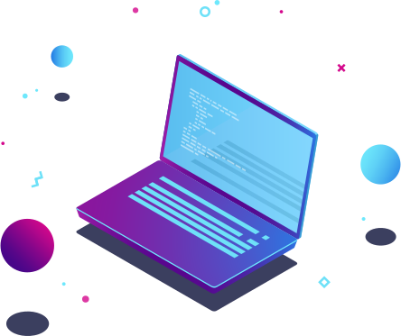

 
  Sempre fui apaixonado por tecnologia. Formado em Sistemas de Informação em 2017 na Universidade Mauricio de Nassau, tive a opotunidade de participar de vários bootcamps e atualmente estou na T.EX Technology Experts na trilha Fullstack JavaScript, sigo me aperfeiçoando em <strong>HTML5 | CSS3 | javaScript | React.js | Next.js | Git | GitHub.</strong>

  🦄 Também estou Estudando: <strong>Node | SQL | Metodologias Agéis | UX-UI</strong>

  

  

